<h1 align="center">NutriVigil</h1>

  
  
  
  

---

  <strong>An AI-powered nutrition analysis application using the Gemini v2.5 API.</strong> 
  <em>Educational project demonstrating the integration of Computer Vision and Large Language Models for dietary health analysis.</em>

---

  
  &nbsp;
  

---

## 📂 Project Overview

NutriVigil is a full-stack web application designed to analyze food images and provide nutritional data. It leverages **Google's Gemini v2.5** for image recognition and the **API Ninjas Nutrition database** for caloric breakdown.

**Key Technical Features:**
- **AI Integration:** Implements Gemini API for food recognition from user-uploaded images.
- **Health Algorithm:** Custom logic to cross-reference food data with user health conditions (Diabetes, Hypertension, etc.).
- **Data Visualization:** Renders macro/micronutrients using responsive charts.
- **RESTful Architecture:** Express.js backend handling secure API calls and file uploads via Multer.

---

## 🛠️ Tech Stack

| Frontend                   | Backend                      | Intelligence & Data         |
|:--------------------------:|:---------------------------:|:--------------------------:|
| ⚛️ React (Vite)            | 🖥️ Node.js + Express        | 🤖 Gemini AI v2.5 (Google) |
| 🎨 Tailwind CSS            | 🗂️ Multer (File Handling)   | 🥗 API Ninjas Nutrition    |
| 🗃️ Lucide React            | 🚦 Custom Middleware         | 🔒 Axios                   |

---

## 🗺️ System Architecture

```mermaid
graph TD
  U[🧑 User] -->|Upload Image| FE[⚛️ NutriVigil Frontend]
  FE -->|API Request| BE[🖥️ Express Backend]
  BE -->|Image Analysis| AI[🤖 Gemini 2.5]
  BE -->|Fetch Data| API[🥗 API Ninjas]
  BE -->|Process Logic| LOGIC[🚦 Health Algorithm]
  FE -->|Render Data| UX[UI Components]

```

## Local Installation 
NutriVigil/
 ├─ frontend/       # React + Vite + Tailwind
 ├─ backend/        # Node.js + Express + Multer
 └─ README.md

 ## APIs Required
 To replicate this project, you will need your own API keys:

1. Gemini API Key: Google AI Studio
2. API Ninjas Key: API Ninjas Nutrition
